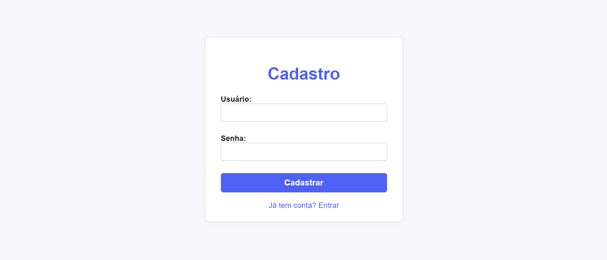
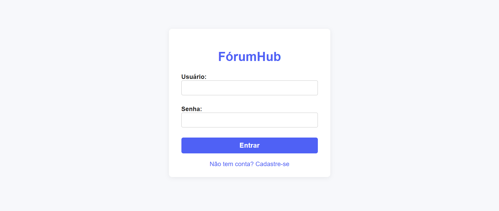
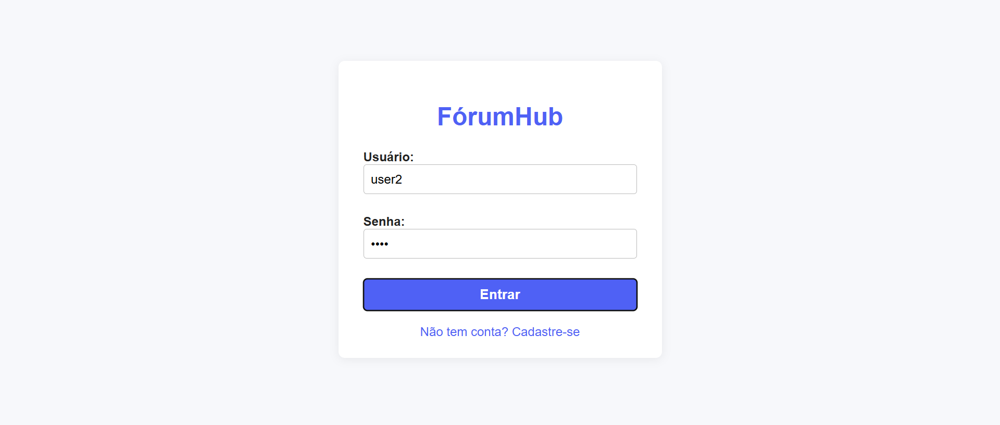
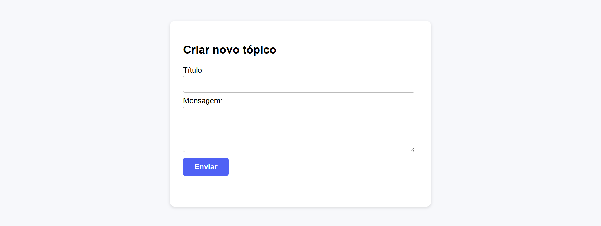
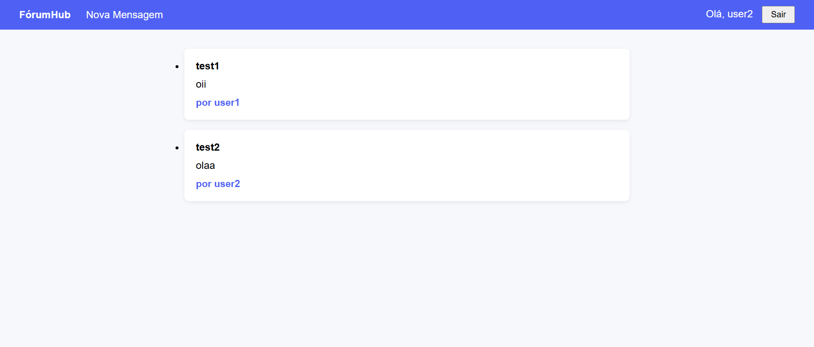
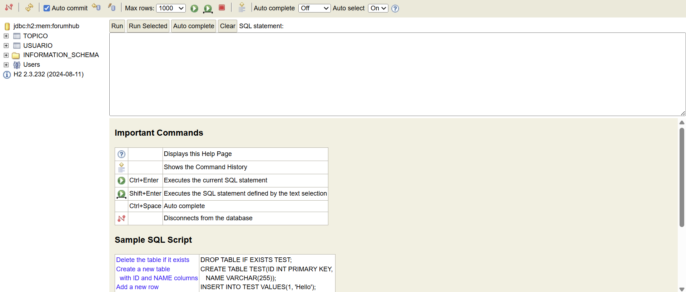
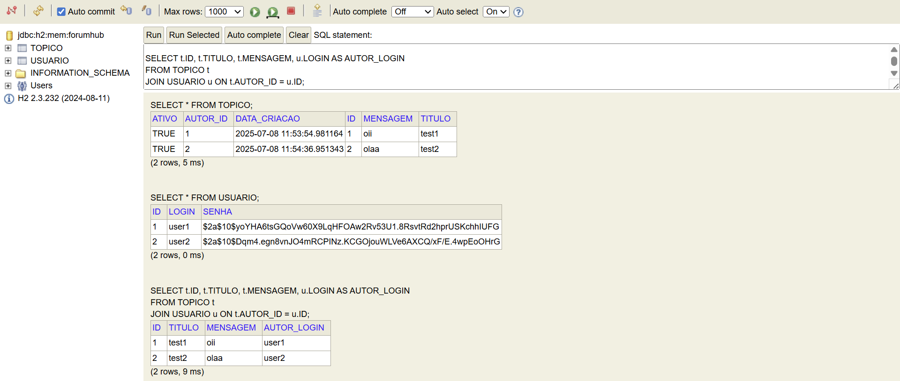
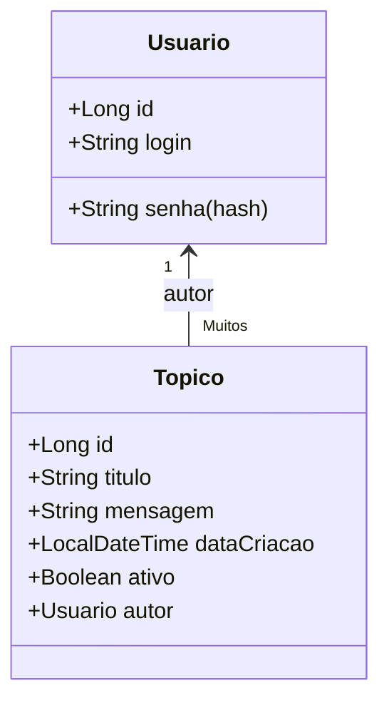

# FórumHub

Bem-vindo ao **FórumHub**, um projeto de fórum simples e moderno para praticar autenticação segura, operações CRUD de tópicos e integração frontend-backend usando **Java (Spring Boot)** e **banco de dados H2 em memória**.

---

## Índice

- [1. Visão Geral](#1-visão-geral)
- [2. Funcionalidades](#2-funcionalidades)
- [3. Como Usar](#3-como-usar)
- [4. Como Rodar o Projeto](#4-como-rodar-o-projeto)
- [5. Acessando o Banco de Dados](#5-acessando-o-banco-de-dados)
- [6. Estrutura do Projeto e Principais Arquivos](#6-estrutura-do-projeto-e-principais-arquivos)
- [7. Diagrama de Classes](#7-diagrama-de-classes)
- [8. Tecnologias Utilizadas](#8-tecnologias-utilizadas)
- [9. Considerações Finais](#9-considerações-finais)
- [10. Referências e Links Úteis](#10-referências-e-links-úteis)

---

## 1. Visão Geral

O **FórumHub** é um projeto full stack criado para demonstrar, de forma didática, como construir uma aplicação web que permite cadastro de usuários, autenticação segura, postagem e visualização de tópicos públicos. Todo backend é em Java (Spring Boot), enquanto o frontend é puro HTML/CSS/JS, tornando fácil entender cada parte. O uso de banco H2 em memória permite testar sem configuração adicional, e a criptografia de senhas garante boas práticas de segurança.

---

## 2. Funcionalidades

- Cadastro de usuários com senha criptografada (BCrypt)
- Login seguro (validação usando hash da senha)
- Criação de tópicos públicos (título e mensagem)
- Visualização de mural de tópicos, com nome do autor
- Associação de tópicos ao autor
- Restringe criação de tópicos a usuários logados
- Banco H2 em memória, fácil de acessar para testes
- Console Web para visualizar e consultar os dados do banco

---

## 3. Como Usar

### 3.1. Cadastro

- Clique em **"Não tem conta? Cadastre-se"** na tela de login.
- Preencha seu usuário e senha, clique em **Cadastrar**.
- Será redirecionado ao login automaticamente.



### 3.2. Login

- Acesse com o login/senha cadastrados.
- Ao logar, aparece a tela para criar novo tópico e acessar o mural.




### 3.3. Criar Novo Tópico

- Escreva um título e uma mensagem, clique em **Enviar**.
- O tópico aparece no mural, junto ao nome do autor.



### 3.4. Mural de Tópicos

- Todos os tópicos aparecem com nome do autor.
- Botão "Nova Mensagem" leva para criação de tópico.



---

## 4. Como Rodar o Projeto

**Pré-requisitos:**  
- [Java 17+](https://www.oracle.com/java/technologies/downloads/)
- [Maven](https://maven.apache.org/)
- [IntelliJ IDEA](https://www.jetbrains.com/idea/) ou [VS Code](https://code.visualstudio.com/)

**Passos:**

1. **Clone o repositório:**
    ```bash
    git clone <URL_DO_REPO>
    cd forumhub
    ```

2. **Rode o backend:**
    ```bash
    ./mvnw spring-boot:run
    ```
    (ou execute a classe `ForumhubApplication.java` pela sua IDE)

3. **Acesse o frontend:**  
    - Abra o arquivo `login.html` no navegador
    - Ou use o [Live Server](https://marketplace.visualstudio.com/items?itemName=ritwickdey.LiveServer) do VS Code para acessar `http://localhost:5500/login.html`

4. **Faça seu cadastro e login normalmente**

---

## 5. Acessando o Banco de Dados

O H2 Database permite ver os dados pelo navegador:

- Abra: [http://localhost:8080/h2-console](http://localhost:8080/h2-console)
- **JDBC URL:** `jdbc:h2:mem:forumhub`
- **User Name:** `sa` (senha em branco)

### Consultando dados no H2 Console

```sql
SELECT * FROM USUARIO;
SELECT * FROM TOPICO;

-- Veja quem postou cada tópico:
SELECT t.ID, t.TITULO, t.MENSAGEM, u.LOGIN AS AUTOR_LOGIN
FROM TOPICO t
JOIN USUARIO u ON t.AUTOR_ID = u.ID;
````

#### Exemplos de telas do banco





---

## 6. Estrutura do Projeto e Principais Arquivos

```
forumhub/
│
├── src/
│   └── main/
│       ├── java/com/delnerodados/forumhub/
│       │   ├── controller/
│       │   │   ├── UsuarioController.java       # Cadastro de usuários
│       │   │   ├── LoginController.java         # Login/autenticação
│       │   │   └── TopicoController.java        # Criar/Listar tópicos
│       │   ├── domain/
│       │   │   ├── usuario/
│       │   │   │   ├── Usuario.java
│       │   │   │   ├── UsuarioRepository.java
│       │   │   │   └── DadosCadastroUsuario.java
│       │   │   └── topico/
│       │   │       ├── Topico.java
│       │   │       ├── TopicoRepository.java
│       │   │       └── DadosCadastroTopico.java
│       │   └── config/
│       │       ├── WebConfig.java
│       │       └── SecurityConfig.java
│       └── resources/
│           └── application.properties
│
├── print/
│   └── (imagens ilustrativas do sistema)
├── login.html           # Tela de login
├── cadastro.html        # Tela de cadastro
├── forumhub.html        # Criar novo tópico
├── chat.html            # Listagem de tópicos
└── README.md
```

---

## 7. Diagrama de Classes



---

## 8. Tecnologias Utilizadas

* **Java 17**
* **Spring Boot** (Web, Data JPA, Validation)
* **Banco H2** (em memória)
* **HTML, CSS, JavaScript** (frontend)
* **BCryptPasswordEncoder** (criptografia de senha)
* **Maven** (build)
* **IntelliJ IDEA / VS Code**

---

## 9. Considerações Finais

* O projeto é **didático**, ótimo para quem está aprendendo sobre web, APIs REST, autenticação e integração full stack.
* Os dados são apagados ao reiniciar, já que o banco é em memória.
* Fácil de expandir para outras funcionalidades (comentários, edição de tópicos, perfis de usuário, etc.).
* Código limpo, organizado, respostas JSON padronizadas, exemplos de integração frontend-backend.

---

## 10. Referências e Links Úteis

* [Documentação Spring Boot](https://spring.io/projects/spring-boot)
* [Documentação H2 Database](https://www.h2database.com/html/main.html)
* [Como escrever um bom README (Alura)](https://www.alura.com.br/artigos/escrever-bom-readme)
* [Live Server para VS Code](https://marketplace.visualstudio.com/items?itemName=ritwickdey.LiveServer)
* [PlantUML para diagramas de classes](https://www.plantuml.com/plantuml/uml)

---
